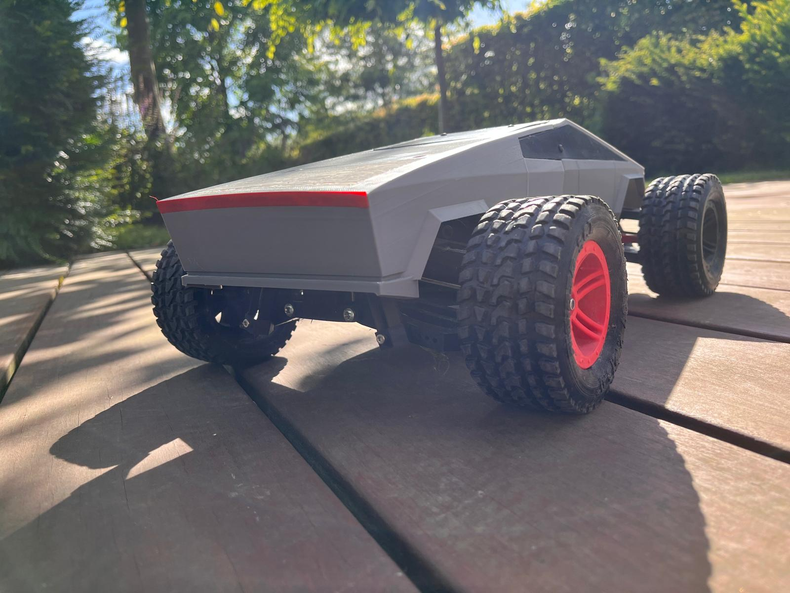

# Fri3d rc car
This is a project to build a 3D printed remote controlled car. The car body is based on the [Cybertruck](https://www.tesla.com/cybertruck) from Tesla. The car is designed to be 3D printed and to be controlled by a remote control.

# How to start?
There is a combination of printed parts and off the shelf parts. Both off the shelf parts and printed parts are listed in the [Bill of Material](#Bill-of-Material). Off the shelf parts can be bought from various online stores such as the one proposed in the Link column.
The printed parts are available in the [stl](stl) directory. The original design files are available in the [shapr](shapr) directory.
The printed parts are designed to be printed with a 0.4mm nozzle and a layer height of 0.2mm on a printer with a maximum size of 25cm x 25cm x 25cm. The parts are designed to be printed with PLA, but some parts are designed to be printed with TPU (to absorb impact).

The car is designed with durability in mind. You will notice we use metal differentials and metal dog bones to transfer the power from the motor to the wheels. It makes the car more expensive, but it will last longer. 
For more durability, some parts need to be printed in TPU (flexible filament). The bumper, the caster claws, and the top and bottom of the wings are designed to absorb the impact of a crash if printed in flexible filament.

# Assembly
Once you have the printed the parts on your printer and bought some off the shelf parts, you can start to assemble the car as described in the following documents:
1. [Part 1 - Body](manual/part1-body.pdf) 
2. [Part 2 - Front & Back](manual/part2-front-back.pdf)
3. [Part 3 - Final](manual/part3-final.pdf)

# Bill of Material
## Off the shelf parts
| Check                                        | Description                          | # | Geert | Fre | cost | Comment                        | Link                                                                                                                            |
|----------------------------------------------|--------------------------------------|---|-------|-----|------|--------------------------------|---------------------------------------------------------------------------------------------------------------------------------|
|                                              | Motor + ESC                          | 1 | 1 + 3 |     | 40€  | Test Pulsar B-20, B-40         | [aliexpress.com](https://nl.aliexpress.com/item/1005006742987156.html)                                                          |
| &#10004;  | Motor Mount                          | 1 |       | 6   | 3€   |                                | [conrad.be](https://www.conrad.be/nl/p/reely-536014c-reserveonderdeel-motorhouder-1418556.html)                                 |
| &#10004;  | Pinion                               | 1 | 5+5+7 |     | 5€   | 12T, 15T, 20T                  | [absima.be](https://www.absima.shop/pp/alu-pinion-32dp/module0-8-20T.html)                                                      |
| &#10004;  | Battery                              | 1 | 4     | 6   | 20€  | 5200mAh, 2S, 80C               | [amazon.de](https://www.amazon.de/-/en/dp/B08X4GF9DK?psc=1&ref=ppx_yo2ov_dt_b_product_details)                                  |
|                                              | Servo                                | 1 | 3     |     | 15€  |                                | [aliexpress.com](https://nl.aliexpress.com/item/1005007301836255.html)                                                          |
|                                              | Receiver + Transmitter               | 1 | 3     |     | 25€  |                                | [conrad.be](https://www.conrad.be/nl/p/reely-gen4-rc-pistoolzender-2-4-ghz-aantal-kanalen-4-incl-ontvanger-2267650.html)        |
| &#10004;  | Differential                         | 2 |       | 12  | 15€  |                                | [conrad.be](https://www.conrad.be/nl/p/reely-10003-reserveonderdeel-differentieel-712524.html)                                  |
| &#10004;  | Differential - Drive shaft Connector | 2 |       | 12  | 5€   |                                | [conrad.be](https://www.conrad.be/nl/p/reely-536026-reserveonderdeel-conische-tandwielen-met-differentieeluitgang-1301672.html) |
| &#10004;  | Dog bone                             | 4 | 8     | 12  | 15€  | needs thread lock!             | [amazon.de](https://www.amazon.de/-/en/dp/B08FMJXFCH?psc=1&ref=ppx_yo2ov_dt_b_product_details)                                  |
| &#10004;  | Bearing - 10X15X4                    | 8 |       | 40  | 5€   |                                | [aliexpress.com](https://nl.aliexpress.com/item/32904604356.html)                                                               |
| &#10004;  | Bearing - 5X10X4                     | 8 |       | 40  | 5€   |                                | [aliexpress.com](https://nl.aliexpress.com/item/32905646461.html)                                                               |
| &#10004;  | Hot glue                             |   | Y     | Y   | -    |                                |                                                                                                                                 |
| &#10004;  | CA glue                              |   | Y     | Y   | -    |                                |                                                                                                                                 |
| &#10004;  | Duct tape                            |   | Y     | Y   | -    |                                |                                                                                                                                 |
| &#10004;  | Screws M3                            | 1 | 3     | 3   | 8€   | 440 pieces                     | [Amazon.de](https://www.amazon.de/-/nl/dp/B0B3MGZ7T2/ref=pd_day0fbt_thbs_d_sccl_2/257-0877788-9470555)                          |
| &#10004;  | Screws M4 (100mm or 70mm)            | 4 |       | 20  | 2€   | Bottom wing - plate connection |                                                                                                                                 |
| &#10004;  | Wheel Fastener                       | 4 |       | 20  | 2€   |                                | [aliexpress.nl](https://nl.aliexpress.com/item/32947782005.html)                                                                |
| &#10004;  | Threaded inserts                     | 8 | Y     | Y   | -    | Diff cover                     | [ruthex.de](https://www.ruthex.de/en/collections/gewindeeinsatze/m3)                                                            |
| &#10004;  | Rubber band                          | 4 | Y     | Y   | -    | Shock                          |                                                                                                                                 |

## Printed parts
Depending on the print settings, you will need around 2KG of Filament to print all the parts. Instead of PLA, you can also use PETG, ABS.

| Check                                          | Description                                                    | Material       | # | Geert | Fre | Comment                                                       |
|------------------------------------------------|----------------------------------------------------------------|----------------|---|-------|-----|---------------------------------------------------------------|
| &#10004;    | Receiver box                                                   | PLA            | 1 |       | 5   | will use OOTB                                                 |
|                                                | Servo - steering rod                                           |                | 1 |       | 5   |                                                               |
|                                                |                                                                |                |   |       |     |                                                               |
| &#10004;    | [Wheel - tire](stl/wheel-tire.stl)                             | TPU-A95        | 4 | 12+4  | 8   | Last set of 4 are from test vehicle                           |
| &#10004;    | [Wheel - rim](stl/wheel-rim.stl)                               | PLA            | 4 | 12+4  | 8   | Last set of 4 are from test vehicle                           |
|                                                | [Wheel - hex](stl/wheel-hex.stl)                               | PLA            | 4 |       | 30  | Still need to make 2mmx1cm hex pins                           |
| &#10004;    | [Plate - center](stl/plate-center.stl)                         | PLA            | 1 | 2+3   | 1   | 3 cannot handle long M4 x 100mm, 2 have a minor defect on top |
| &#10004;    | [Plate - front](stl/plate-bottom-front.stl)                    | PLA            | 1 | 6     | 1   |                                                               |
| &#10004;    | [Plate - rear](stl/plate-bottom-rear.stl)                      | PLA            | 1 | 6     | 1   |                                                               |
| &#10004;    | [Plate - Diff - top](stl/plate-diff-top.stl)                   | PLA            | 2 | 12    | 2   | print with 100% fill rate                                     |
| &#10004;    | [Plate - battery - holder](stl/plate-battery-holder.stl)       | PLA            | 1 |       | 5   |                                                               |
| &#10004;    | [Wing - bottom](stl/wing-bottom.stl)                           | PLA or TPU-A98 | 4 | 24    | 8   | use TPU to absorb impact                                      |
| &#10004;    | [Wing - top](stl/wing-top.stl)                                 | PLA or TPU-A98 | 4 | 24    | 8   | use TPU to absorb impact                                      |
|                                                | [Caster - claw](stl/turn-caster)                               | TPU-A98        | 4 | 24+20 | 4   | use TPU to absorb impact                                      |
|                                                | [Caster - turning](stl/turn-front)                             | PLA            | 2 | 12    | 2   |                                                               |
|                                                | [Caster - fixed](stl/turn-rear)                                | PLA            | 2 | 15    | 2   |                                                               |
| &#10004;    | [Shock - slider](stl/Shock.stl)                                | PLA            | 8 | 56    | 8   |                                                               |
| &#10004;    | [Shock - cap](stl/Shock.stl)                                   | PLA            | 8 | 56    | 8   |                                                               |
| &#10004;    | [Steer - turn-left](stl/steering-left.stl)                     | PLA            | 1 | 6     | 6   |                                                               |
| &#10004;    | [Steer - turn-right](stl/steering-right.stl)                   | PLA            | 1 | 6     | 6   |                                                               |
| &#10004;    | [Steer - connector](stl/steering-connect.stl)                  | PLA or TPU-A95 | 1 | 6     | 6   | TPU acts as servo saver                                       |
| &#10004;    | [Steer - rings](stl/steering-rings.stl)                        | PLA            | 2 |       | 12  |                                                               |
| &#10004;    | [Steer - top](stl/steering-top.stl)                            | PLA            | 1 | 6     | 6   |                                                               |
| &#10004;    | [Steer - rod - 67mm](stl/steering-arm-67mm.stl)                | PLA or TPU-A95 | 2 | 10    | 12  | TPU acts as servo saver                                       |
| &#10004;    | [Driveshaft - bearing](stl/driveshaft-bearing-28x12.5x8.stl)   | PLA            | 1 |       | 6   |                                                               |
|                                                | [Driveshaft - gear 48T](stl/driveshaft-gear-48T.stl)           | PLA            | 1 |       |     | print with 100% fill rate                                     |
| &#10004;    | [Driveshaft - gear 60T](stl/driveshaft-gear-60T.stl)           | PLA            | 1 |       | 6   | print with 100% fill rate                                     |
| &#10004;    | [Driveshaft - axle](stl/driveshaft.stl)                        | PLA or ABS     | 1 |       | 6   | print with 100% fill rate                                     |
| &#10004;    | [Bumper](stl/bumper.stl)                                       | TPU-A95        | 1 |       | 6   | use TPU to absorb impact                                      |
| &#10004;    | [Cybertruck - front](stl/Cybertruck-front.stl)                 | PLA            | 1 |       | 5   |                                                               |
| &#10004;    | [Cybertruck - front - holder](stl/Cybertruck-front-holder.stl) | PLA            | 1 |       | 5   |                                                               |
| &#10004;    | [Cybertruck - rear](stl/Cybertruck-rear.stl)                   | PLA            | 1 |       | 5   |                                                               |
| &#10004;    | [Cybertruck - rear - holder](stl/Cybertruck-rear-holder.stl)   | PLA            | 1 |       | 5   |                                                               |
| &#10004;    | [Cybertruck - decal](stl/Cybertruck-decal.stl)                 | PLA            | 1 |       | 5   |                                                               |
| &#10004;    | [Cybertruck - logo](stl/Cybertruck-logo.stl)                   | PLA            | 1 |       | 5   |                                                               |

