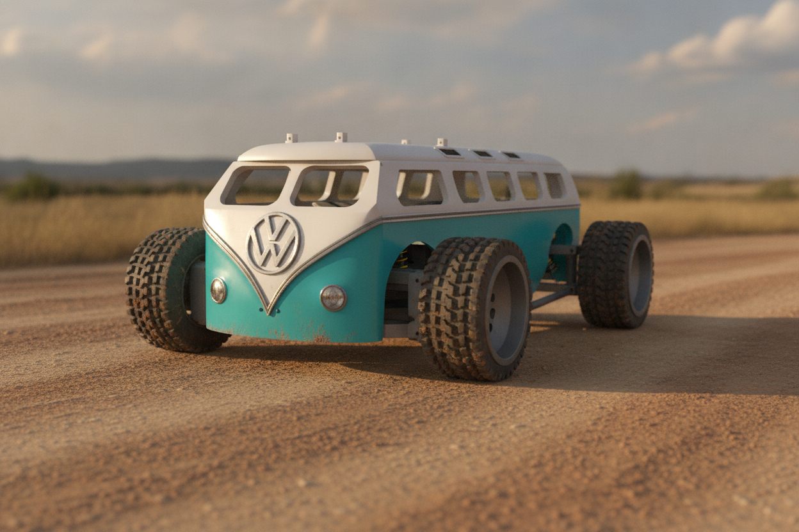

# Fri3d RC Car

This is a project to build a 3D printed remote controlled car. The car body is based on the classic Volkswagen Bus, reimagined as an off-road RC hot rod. The car is designed to be 3D printed and to be controlled by a remote control.

## Design Philosophy

The car uses off-the-shelf drivetrain components compatible with **Traxxas Slash 4x4** parts:

- **Differentials** - Metal differentials with bearings
- **Driveshafts** - CVD steel driveshafts and metal center driveshaft
- **Slipper Clutch** - Complete metal slipper clutch assembly
- **Drive Hubs** - Steel drive hub sets

This makes the car durable and easy to repair with widely available RC car parts.

## Parts List

### Motor & Electronics

| Item                   | Description         | Link                                                                                                                                              | Price | Qty |
| ---------------------- | ------------------- | ------------------------------------------------------------------------------------------------------------------------------------------------- | ----- | --- |
| Motor + ESC            | Pulsar B-20 or B-40 | <a href="https://nl.aliexpress.com/item/1005006742987156.html" target="_blank" rel="noopener noreferrer">AliExpress</a>                                                                                | ~€30  | 1   |
| Pinion                 | 12T, 15T, or 20T    | <a href="https://www.absima.shop/pp/alu-pinion-32dp/module0-8-20T.htm?shop=absima_en&SessionId=&a=article&ProdNr=2310348&t=19114&c=19132&p=19132" target="_blank" rel="noopener noreferrer">Absima</a> | ~€5   | 1   |
| Battery                | 5200mAh, 2S, 80C    | <a href="https://www.amazon.de/-/en/dp/B08X4GF9DK" target="_blank" rel="noopener noreferrer">Amazon</a>                                                                                                | ~€30  | 1   |
| Servo                  |                     | <a href="https://nl.aliexpress.com/item/1005007301836255.html" target="_blank" rel="noopener noreferrer">AliExpress</a>                                                                                | ~€10  | 1   |
| Receiver + Transmitter |                     |                                                                                                                                                   |       | 1   |

### Drivetrain (Differentials, Driveshafts & Slipper Clutch)

| Item                          | Description                                                                                                                                                                                                         | Link                                                                                                                                        | Price        | Qty |
| ----------------------------- | ------------------------------------------------------------------------------------------------------------------------------------------------------------------------------------------------------------------- | ------------------------------------------------------------------------------------------------------------------------------------------- | ------------ | --- |
| Differential (2pcs)           | Front/Rear Differential with Bearing for Slash 4X4 VXL Stampede Rustler                                                                                                                                             | <a href="https://www.aliexpress.com/item/1005007378476905.html" target="_blank" rel="noopener noreferrer">AliExpress</a>                    | ~€12         | 1   |
| Rear Ring Gear 6879           | Rear Differential Ring Gear G4713 6879 for Traxxas Slash 4X4                                                                                                                                                        | <a href="https://www.aliexpress.com/item/32948469179.html" target="_blank" rel="noopener noreferrer">AliExpress</a>                         | ~€2          | 1   |
| Front Ring Gear G4513         | Front Differential Ring Gear G4513 for Traxxas Slash 4x4                                                                                                                                                            | <a href="https://www.aliexpress.com/item/32952095481.html" target="_blank" rel="noopener noreferrer">AliExpress</a>                         | ~€6          | 1   |
| CVD Driveshaft (Front & Rear) | GRC Extreme Heavy Duty CVD U-Joint Steel Driveshaft for Traxxas Slash/Stampede/Hoss/Rustler VXL 4X4 Platinum Ultimate Update Parts, Replace #6851 - used for both front and rear (sold in packs of 2, need 2 packs) | <a href="https://www.temu.com/goods.html?goods_id=605796830151694&sku_id=92876117669400" target="_blank" rel="noopener noreferrer">Temu</a> | ~€13.50/pack | 2   |
| Center Driveshaft 6855        | Metal Center Driveshaft 6855 for Traxxas Slash 4X4 4WD Rally (Red)                                                                                                                                                  | <a href="https://www.aliexpress.com/item/1005005894739029.html" target="_blank" rel="noopener noreferrer">AliExpress</a>                    | ~€3          | 1   |
| Drive Hub Set Front           | Steel Drive Hub Set for Traxxas Slash 4X4 VXL/Rustler/Stampede/XO-1 (**Front** **only**)                                                                                                                            | <a href="https://www.aliexpress.com/item/1005009469068869.html" target="_blank" rel="noopener noreferrer">AliExpress</a>                    | ~€2          | 1   |
| Slipper Clutch                | Complete Slipper Clutch Assembly for Traxxas Slash Stampede 4X4 Rally                                                                                                                                               | <a href="https://www.aliexpress.com/item/1005007927630121.html" target="_blank" rel="noopener noreferrer">AliExpress</a>                    | ~€8          | 1   |
| Motor Mount                   | Adjustable Motor Mounting Bracket Holder for 540/3660/3650 Brushless Motors                                                                                                                                         | <a href="https://nl.aliexpress.com/item/4000424368907.html" target="_blank" rel="noopener noreferrer">AliExpress</a>                        | ~€4          | 1   |

### Bearings

| Item | Description | Link | Price | Qty |
| ---- | ----------- | ---- | ----- | --- |
| Bearing 5x11x4mm | MR115-2RS Bearing 10pcs 5x11x4mm Steel Double Shielded | <a href="https://nl.aliexpress.com/item/32824707297.html" target="_blank" rel="noopener noreferrer">AliExpress</a> | ~€4 | 1 |
| Bearing 6x12x4mm | MR126RS Bearing 10pcs 6x12x4mm ABEC-7 Blue Sealed | <a href="https://www.aliexpress.com/item/1005006083328247.html" target="_blank" rel="noopener noreferrer">AliExpress</a> | ~€4 | 1 |
| Bearing 10x15x4mm | 6700-2RS Bearing 10pcs 10x15x4mm ABEC-3 Blue Sealed | <a href="https://nl.aliexpress.com/item/32904604356.html" target="_blank" rel="noopener noreferrer">AliExpress</a> | ~€4 | 1 |
| Bearing 12x18x4mm | 6701-2RS Bearing 10pcs 12x18x4mm ABEC-7 Blue Sealed | <a href="https://www.aliexpress.com/item/1005006475668561.html" target="_blank" rel="noopener noreferrer">AliExpress</a> | ~€4 | 1 |

### Fasteners & Hardware

| Item                | Description                                                        | Link                                                                                                                     | Price | Qty |
| ------------------- | ------------------------------------------------------------------ | ------------------------------------------------------------------------------------------------------------------------ | ----- | --- |
| Screw Bolt Set M3   | M2 M3 M4 Screw Bolt Set for RC Crawler Bumper Driveshaft Pin       | <a href="https://www.aliexpress.com/item/1005009800470993.html" target="_blank" rel="noopener noreferrer">AliExpress</a> | ~€2   | 1   |
| Lock Nuts M5        | 304/316 Stainless Steel Flange Nylon Lock Nuts M5 Serrated (20pcs) | <a href="https://www.aliexpress.com/item/1005009771309255.html" target="_blank" rel="noopener noreferrer">AliExpress</a> | ~€2   | 1   |
| Dowel Pins M2       | GB119 Cylindrical Dowel Pins M2 304 Stainless Steel (50pcs, 10mm)  | <a href="https://www.aliexpress.com/item/1005007023343232.html" target="_blank" rel="noopener noreferrer">AliExpress</a> | ~€2   | 1   |
| Heat Insert Nuts M3 | Brass Heat Insert Nuts M3xL5xOD4.5 for 3D Printing (50pcs)         | <a href="https://www.aliexpress.com/item/1005006472702418.html" target="_blank" rel="noopener noreferrer">AliExpress</a> | ~€2   | 1   |
| Screws M3           | M3 Hex Socket Screws Set (440pcs)                                  | <a href="https://www.amazon.de/-/nl/dp/B0B3MGZ7T2" target="_blank" rel="noopener noreferrer">Amazon</a>                  | ~€10  | 1   |
| Body Shell Clips    | MJX Hyper Go R-type Body Shell Clips Pin (24pcs)                   | <a href="https://www.aliexpress.com/item/1005009096269708.html" target="_blank" rel="noopener noreferrer">AliExpress</a> | ~€2   | 1   |

## Printed Parts

Depending on the print settings, you will need around 2KG of Filament to print all the parts. Instead of PLA, you can also use PETG or ABS.

For TPU parts (except tires), we recommend <a href="https://extrudr.com/en/at/products/flex-hard/" target="_blank" rel="noopener noreferrer">Extrudr Flex Hard</a> for better impact absorption.

| Part | Material | Qty | Notes |
|------|----------|-----|-------|
| <a href="files/plate-front-bottom.stl" target="_blank" rel="noopener noreferrer">Plate - front - bottom</a> | PLA | 1 | |
| <a href="files/plate-rear-bottom.stl" target="_blank" rel="noopener noreferrer">Plate - rear - bottom</a> | PLA | 1 | |
| <a href="files/plate-diff-front-top.stl" target="_blank" rel="noopener noreferrer">Plate - diff - front - top</a> | PLA | 1 | **100% infill** |
| <a href="files/plate-diff-rear-top.stl" target="_blank" rel="noopener noreferrer">Plate - diff - rear - top</a> | PLA | 1 | **100% infill** |
| <a href="files/plate-battery-holder.stl" target="_blank" rel="noopener noreferrer">Plate - battery - holder</a> | PLA | 1 | |
| <a href="files/wing-bottom.stl" target="_blank" rel="noopener noreferrer">Wing - bottom</a> | PLA/TPU-A98 | 4 | TPU for impact |
| <a href="files/wing-top.stl" target="_blank" rel="noopener noreferrer">Wing - top</a> | PLA/TPU-A98 | 4 | TPU for impact |
| <a href="files/turn-caster-front.stl" target="_blank" rel="noopener noreferrer">Turn - caster - front</a> | PLA | 2 | |
| <a href="files/turn-caster-rear.stl" target="_blank" rel="noopener noreferrer">Turn - caster - rear</a> | PLA | 2 | |
| <a href="files/turn-front.stl" target="_blank" rel="noopener noreferrer">Turn - front</a> | PLA | 2 | **100% infill** |
| <a href="files/steering-left.stl" target="_blank" rel="noopener noreferrer">Steering - left</a> | PLA | 1 | |
| <a href="files/steering-right.stl" target="_blank" rel="noopener noreferrer">Steering - right</a> | PLA | 1 | |
| <a href="files/steering-connect.stl" target="_blank" rel="noopener noreferrer">Steering - connector</a> | PLA/TPU-A95 | 1 | TPU = servo saver |
| <a href="files/steering-rings.stl" target="_blank" rel="noopener noreferrer">Steering - rings</a> | PLA | 2 | |
| <a href="files/steering-top.stl" target="_blank" rel="noopener noreferrer">Steering - top</a> | PLA | 1 | |
| <a href="files/steering-arm-75mm.stl" target="_blank" rel="noopener noreferrer">Steering - rod - 75mm</a> | PLA/TPU-A95 | 2 | TPU = servo saver |

### VW Bus Body

| Part | Material | Qty | Notes |
|------|----------|-----|-------|
| <a href="files/vw-bus/bus-front.stl" target="_blank" rel="noopener noreferrer">Bus - front</a> | PLA/PETG | 1 | |
| <a href="files/vw-bus/bus-rear.stl" target="_blank" rel="noopener noreferrer">Bus - rear</a> | PLA/PETG | 1 | |
| <a href="files/vw-bus/roof-front.stl" target="_blank" rel="noopener noreferrer">Roof - front</a> | PLA/PETG | 1 | |
| <a href="files/vw-bus/roof-rear.stl" target="_blank" rel="noopener noreferrer">Roof - rear</a> | PLA/PETG | 1 | |
| <a href="files/vw-bus/nose.stl" target="_blank" rel="noopener noreferrer">Nose</a> | PLA/PETG | 1 | |
| <a href="files/vw-bus/logo.stl" target="_blank" rel="noopener noreferrer">Logo</a> | PLA/PETG | 1 | |
| <a href="files/vw-bus/light.stl" target="_blank" rel="noopener noreferrer">Light</a> | PLA/PETG | 1 | |
| <a href="files/vw-bus/rail-nose-left.stl" target="_blank" rel="noopener noreferrer">Rail - nose - left</a> | PLA/PETG | 1 | |
| <a href="files/vw-bus/rail-nose-right%20.stl" target="_blank" rel="noopener noreferrer">Rail - nose - right</a> | PLA/PETG | 1 | |
| <a href="files/vw-bus/rail-front-left.stl" target="_blank" rel="noopener noreferrer">Rail - front - left</a> | PLA/PETG | 1 | |
| <a href="files/vw-bus/rail-front-right.stl" target="_blank" rel="noopener noreferrer">Rail - front - right</a> | PLA/PETG | 1 | |
| <a href="files/vw-bus/rail-rear-left%20.stl" target="_blank" rel="noopener noreferrer">Rail - rear - left</a> | PLA/PETG | 1 | |
| <a href="files/vw-bus/rail-rear-right.stl" target="_blank" rel="noopener noreferrer">Rail - rear - right</a> | PLA/PETG | 1 | |

### Optional Printed Parts

These parts can also be bought off the shelf.

| Part | Material | Qty | Notes |
|------|----------|-----|-------|
| <a href="files/shock.stl" target="_blank" rel="noopener noreferrer">Shock</a> | PLA | 8 | Slider and cap |
| <a href="files/wheel-tire.stl" target="_blank" rel="noopener noreferrer">Wheel - tire</a> | TPU-A95 | 4 | |
| <a href="files/wheel-rim.stl" target="_blank" rel="noopener noreferrer">Wheel - rim</a> | PLA | 4 | |
| <a href="files/wheel-hex.stl" target="_blank" rel="noopener noreferrer">Wheel - hex</a> | PLA | 4 | |

